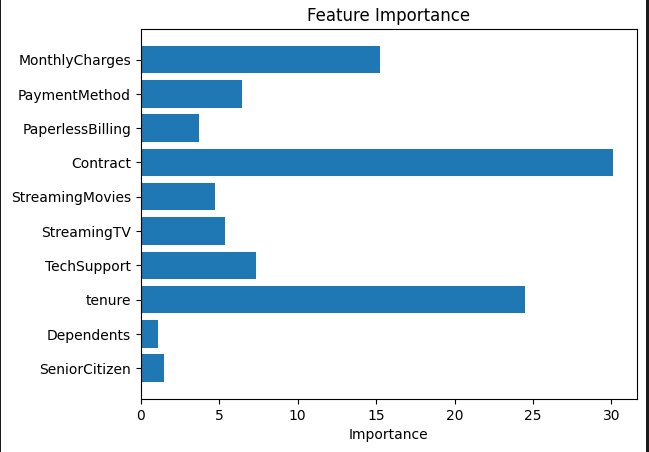
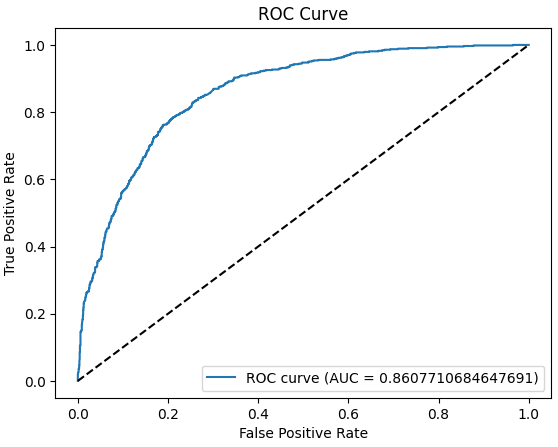

# 🧠 Telco-Customer-Churn-Prediction

Цель проекта — предсказать отток клиентов телеком-компании на основе табличных данных с помощью модели CatBoostClassifier. Используется отбор признаков, оптимизация порога по F1, визуализация ROC-кривой и важности признаков.

## 📊 Используемая модель и метрики

- **Модель**: CatBoostClassifier (градиентный бустинг на решающих деревьях)
- **Лосс-функция**: `Logloss` — стандарт для бинарной классификации, хорошо работает при вероятностной интерпретации.
- **Основные метрики**:
  - `ROC AUC` — показывает, насколько модель может хорошо различать классы. Её визуализацию вы можете найти в соответствующем разделе репозитория.
  - `F1-score` — баланс между точностью и полнотой, важно при дисбалансе классов.
  - `Recall` — уделено особое внимание при подборе порога, так как при предсказании оттока важно акцентировать на ней внимание. Ложные срабатывания не настолько страшны, как пропущенные случаи.

CatBoost был выбран из-за его способности работать с категориальными признаками без ручного кодирования и высокой производительности.

## 📁 Описание данных

Источник: [Kaggle - Telco Customer Churn](https://www.kaggle.com/datasets/blastchar/telco-customer-churn)

Количество объектов: 7043  
Количество признаков: 21  
Целевая переменная: `Churn` — ушёл клиент или нет

## 📷 Визуализации

### ROC-кривая  


### Важность признаков  


## 📌 Результаты модели

```text
              precision    recall  f1-score   support

           0       0.90      0.81      0.85      1697
           1       0.60      0.76      0.67       628

    accuracy                           0.80      2325
   macro avg       0.75      0.79      0.76      2325
weighted avg       0.82      0.80      0.80      2325
